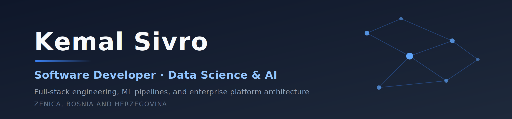

<!-- Banner: PNG for guaranteed rendering on GitHub. assets/header.svg is the editable source.
     Re-export to assets/header.png at 2400px wide after any edit. -->

  
  
  

---

I build production software at the point where application engineering meets machine learning. .NET and FastAPI services on one side, PyTorch pipelines and reinforcement learning on the other. Most of my work is about taking something undocumented and messy and turning it into a system with rules: an untangled enterprise platform, a scanned form that becomes a validated patient record, a scheduling policy you can actually verify.

Currently a **Software Developer** at GRAFiT BA and a **Teaching Assistant** at the Faculty of Electrical Engineering in Sarajevo, while finishing a BSc in **Data Science and Artificial Intelligence**.

### Now

| | |
| :--- | :--- |
| **Software Developer**, GRAFiT BA | Backend services in .NET and FastAPI, enterprise system integration, React Native clients |
| **Teaching Assistant**, ETF University of Sarajevo | Python, C++, Algorithms and Data Structures |
| **BSc Data Science & AI**, ETF University of Sarajevo | 2024 to present |

What I'm most interested in next: applied ML and data science roles, and backend or full-stack work on systems where correctness actually matters.

---

## Selected work

### [Clarity](https://github.com/vrosi21/Clarity) &nbsp;·&nbsp; reinforcement learning + full-stack

A Kanban board with an embedded, from-scratch RL agent that assigns tickets based on workload, skill profile, and historical performance, instead of whoever grabs them first.

- Q-network written from scratch in NumPy (12-64-32-1, Adam, experience replay, target network) with Boltzmann exploration
- Sentence-transformer cosine similarity replaces one-hot skill encoding, cutting state dimensionality from 17 to 12
- Ticket lifecycle modelled as a 6-state DFA with machine-checked safety invariants; deadlock freedom verified by BFS over the LTS product state space
- Over 500 simulated sprints (~17.9k assignments) against a greedy baseline: **makespan −9.5%**, **blocking rate −43%**, **load variance −63%**

### [Medical Form OCR Pipeline](https://github.com/vrosi21/form-ocr-pipeline) &nbsp;·&nbsp; computer vision

A staged OCR pipeline for handwritten medical intake forms. It reads twenty fields per scanned form, corrects the raw reading in stages, matches the form against a patient database, and routes anything it is unsure about to human review.

- Four stages: fiducial-based affine registration → CLAHE preprocessing → per-field model routing (MNIST CNN + EasyOCR CRNN + pixel density) → weighted fuzzy record linkage
- Field accuracy improved from **20.8% to 98.0%**, with 100% patient-ID accuracy on held-out test data
- Fine-tuned the EasyOCR CRNN recogniser with CTC loss, using an augmentation-safe train/val split and validation-based checkpointing
- Tracked down why EasyOCR returned empty strings on single-character crops. The detection stage was the culprit, so I bypassed it and called the recogniser directly

### [kadJeBus](https://github.com/zeforgezenica/busez) &nbsp;·&nbsp; open source &nbsp;·&nbsp; data engineering

Public transit app for Zenica, built by the ZeForge Zenica community and live at [kadjebus.zeforge.ba](https://kadjebus.zeforge.ba). I worked on the ingestion side, turning scanned PDF timetables into the structured data the whole app runs on.

- Parsed and normalised scanned PDF timetables into relational JSON entities (routes, stations, agencies, cities) that serve as the application's only database, with no SQL layer underneath
- Records are schema-enforced with JSON Schema through AJV, so a malformed or misparsed timetable fails CI instead of reaching commuters
- Served from an Express REST API documented in Swagger/OpenAPI, with Jest and Supertest covering the endpoints on every push

### [Cartel Detection in Public Procurement](https://github.com/uoloki/Anomaly-Detection-in-Procurement) &nbsp;·&nbsp; applied ML research

Detecting bid-rigging cartels in public procurement data using machine learning and network analysis, written up as a full research report.

- Random Forest reaching **89.0% test ROC AUC** on the GTI Labelled Cartel Dataset
- Bidder-level validation rather than random splits, so the score reflects generalisation to genuinely unseen bidders
- Includes the network-analysis branch that *didn't* work, reported as a negative result alongside feature importance and reproducibility appendices

### [Trend Breaks with Semantic Signals](https://github.com/uoloki/Detecting-Trend-Breaks-with-Semantic-Signals) &nbsp;·&nbsp; NLP + time series

Short-term S&P 500 movement prediction that fuses engineered technical indicators with sentiment extracted from financial posts on X.

- Deep learning architectures over a combined price-and-sentiment feature space
- Sentence-transformer embeddings for the semantic signal, with the data-quality and processing pipeline documented end to end

---

## Also worth a look

| Project | What it is | Stack |
| :--- | :--- | :--- |
| **[vehicle-data-lab](https://github.com/vrosi21/vehicle-data-lab)** | Full ML pipeline predicting car prices from 3,045 OLX.ba listings: scraping, cleaning, EDA, modelling. RandomForestRegressor at ~9,985 BAM MAE; GradientBoostingClassifier at 67% accuracy with SMOTE. | Python · scikit-learn · Selenium |
| **[Path-Planning-Visualiser](https://github.com/vrosi21/Path-Planning-Visualiser)** | Interactive simulator showing how six search algorithms (BFS, Dijkstra, A\* and Weighted A\* among them) explore grids and find paths through weighted terrain. | Python · Pygame · PyQt6 |

## Open source

I contribute to [**ZeForge Zenica**](https://github.com/zeforgezenica), a local open-source community. Alongside kadJeBus above, I've worked on [**smetovi**](https://github.com/zeforgezenica/smetovi), an open-source site for the Smetovi mountain area near Zenica, built with Astro and deployed on Cloudflare Pages.

---

## Tech

**Languages** &nbsp;

**AI / ML** &nbsp;

Reinforcement learning · NLP · RAG and LLM tooling · ML pipelines · anomaly detection

**Backend** &nbsp;

**Frontend** &nbsp;

**Platform & DevOps** &nbsp;

Solution architecture · SOLID · CI/CD and release automation · formal verification (DFA / LTS / MDP) · architecture decision records

---

  <strong>English</strong> (fluent) &nbsp;·&nbsp; <strong>German</strong> (conversational) &nbsp;·&nbsp; <strong>Bosnian / Croatian / Serbian</strong> (native)
    
  <a href="https://linkedin.com/in/kemal-sivro">LinkedIn</a> &nbsp;·&nbsp;
  <a href="mailto:kemalsivro@gmail.com">Email</a>

